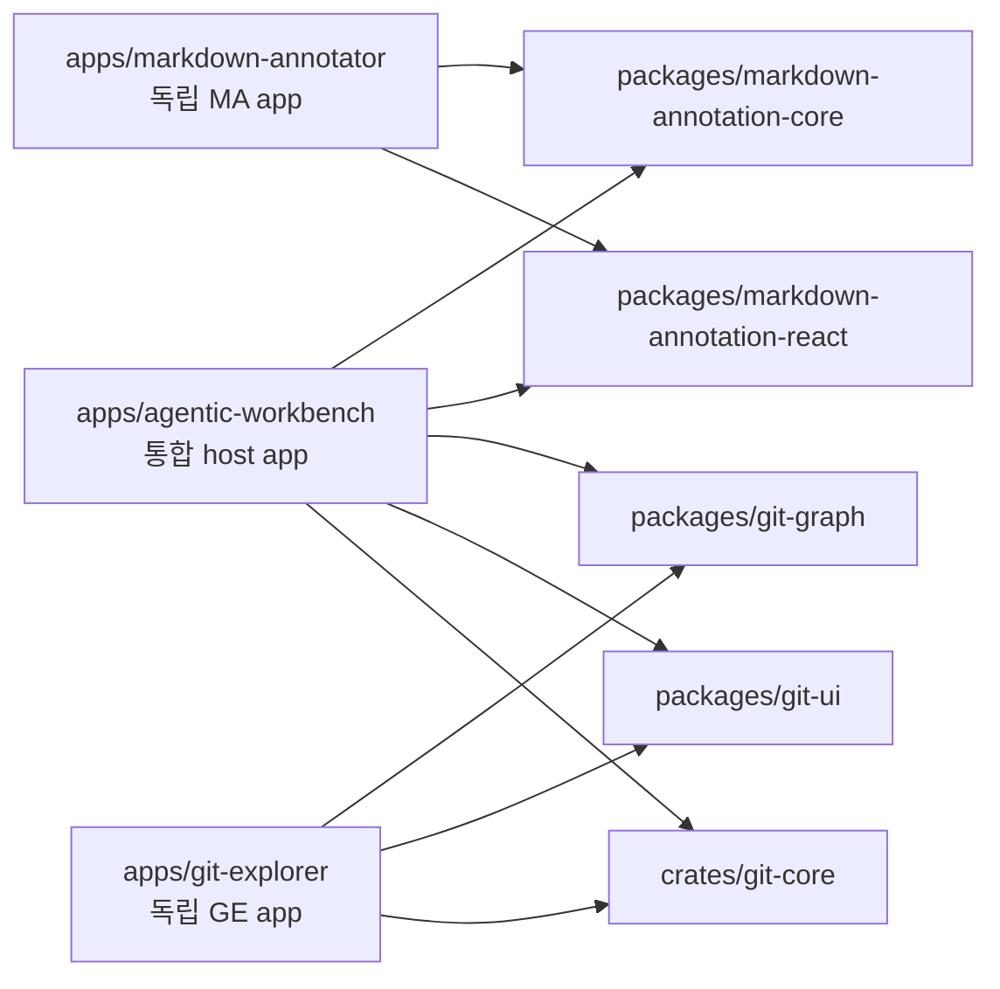
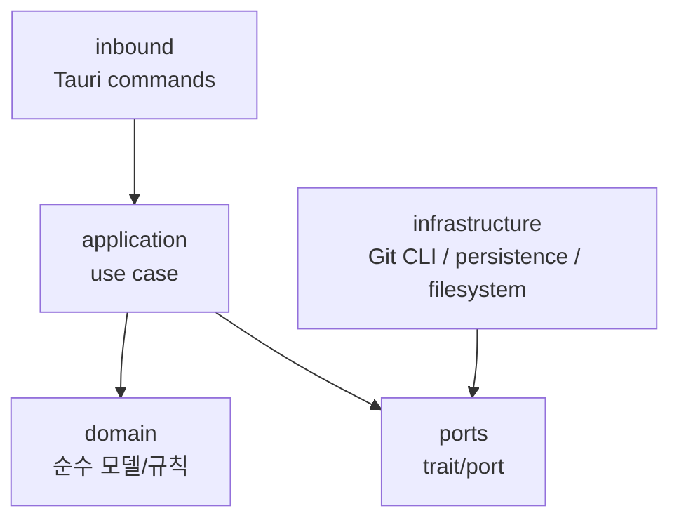

# 디렉토리 명명 점검

## 조사 목표

현재 프로젝트는 `agentic-workbench`(AW)를 중심 host app으로 두고, `markdown-annotator`(MA)와 `git-explorer`(GE)의 기능을 공유 모듈로 분리해 통합하는 과정에 있다. 이 문서는 주요 디렉토리명이 실제 역할을 충분히 드러내는지, 통합 과정에서 오해를 만들 수 있는 이름이 있는지, 향후 rename 또는 구조 정리가 필요한 항목이 있는지 점검한다.

점검 기준은 다음과 같다.

- 앱 경계가 명확한가.
- 공유 패키지와 앱 전용 코드의 경계가 드러나는가.
- Feature-Sliced Design 계층명이 일관적인가.
- Tauri backend의 hexagonal architecture 계층명이 앱 간 일관적인가.
- MA/GE 기능이 AW로 흡수되는 과정에서 중복되거나 너무 넓은 이름이 생기지 않았는가.

## 조사 결과 요약

큰 축의 디렉토리명은 대체로 적절하다. `apps/*`, `packages/*`, `crates/*`, `docs/*`, `examples/*` 구분은 현재 모노레포 구조와 잘 맞는다. 다만 워크스페이스 멤버십은 디렉토리 구분과 1:1로 일치하지 않으니 유의한다.

- `apps/*`, `packages/*`는 pnpm workspace 멤버다(`pnpm-workspace.yaml`).
- `crates/*`와 두 Tauri 앱(`apps/agentic-workbench/src-tauri`, `apps/git-explorer/src-tauri`)은 루트 `Cargo.toml`의 Cargo workspace 멤버다. `crates/git-core`는 두 앱이 `path` 의존으로 참조한다. 반면 `apps/markdown-annotator/src-tauri`는 Cargo workspace 멤버가 아니다(git-core를 쓰지 않음).
- `examples/*`는 어느 workspace 멤버도 아니다(`pnpm-workspace.yaml`에 미등록). 현재 `examples/markdown-annotator`는 샘플 문서만 담고 있다.

다만 AW 내부에는 MA/GE 통합 과정에서 생긴 중간 상태의 이름이 일부 남아 있다. 특히 `worktree-workspace`, `worktree-changes`, `worktree-change-review`는 역할이 겹쳐 보일 수 있고, 실제로 `worktree-changes`와 `worktree-change-review`는 **서로 다른 데이터 소스를 쓰면서도 같은 컴포넌트명 `WorktreeChangesPanel`과 같은 파일명 `worktree-changes-panel.tsx`를 공유**해 혼동을 키운다. 또한 GE backend는 AW/MA와 다른 adapter 계층명을 사용하고 있어 장기적으로 일관성 정리가 필요하다.

## 주요 디렉토리별 판단

| 디렉토리 | 현재 역할 | 판단 |
|---|---|---|
| `apps/agentic-workbench` | AW 본체이자 MA/GE 기능을 소비하는 통합 host app | 적절 |
| `apps/markdown-annotator` | MA 독립 실행 앱, 공유 annotation 패키지 검증 host | 적절 |
| `apps/git-explorer` | GE 독립 실행 앱, Git graph/UI/core 검증 host | 적절 |
| `packages/markdown-annotation-core` | MA의 순수 annotation 타입, 파싱, 포맷 로직 | 적절 |
| `packages/markdown-annotation-react` | MA annotation React UI와 headless helper | 적절 |
| `packages/git-graph` | Git graph layout/type 중심 TS 패키지 | 조건부 적절 |
| `packages/git-ui` | Git 관련 React UI 공유 후보 | 적절 |
| `packages/ui` | 공통 UI primitive | 적절 |
| `crates/git-core` | Rust Git 공유 crate. 실제 구성은 `domain.rs` + `ports.rs` + `git_cli.rs`(CLI provider) + `lib.rs`의 평면 구조(현재 `application.rs`는 없음) | 적절 |
| `examples/markdown-annotator` | MA 샘플 문서 | 적절 |

## 수정 검토 항목

### 1. `packages/git-graph`

현재 역할이 graph layout과 graph type에 한정된다면 이름은 적절하다. 그러나 계획 문서에서는 Git 공유 TS 모델 후보로 `packages/git-model`을 언급하고 있다. 향후 commit query, commit detail, historical diff model까지 이 패키지가 담당한다면 `git-graph`는 너무 좁은 이름이 된다.

권장 판단:

- graph 전용 패키지로 유지할 경우: `packages/git-graph` 유지.
- Git history/detail/diff model까지 확장할 경우: `packages/git-model` 또는 유사한 더 넓은 이름으로 rename 검토.

### 2. `apps/agentic-workbench/src/features/worktree-workspace`

현재 이름은 worktree 안에서 MA/GE 통합 작업 공간을 조립하는 영역으로 보인다. 다만 `workspace`라는 단어가 AW 전체 작업 공간 개념과 겹쳐 넓고 모호하다.

실제 구성요소를 확인한 결과 이 feature는 **markdown annotation viewer와 Git graph를 한 화면에 묶는다**: `ui/markdown-viewer-components.tsx`, `ui/annotation-dialog-components.tsx`, `ui/worktree-workspace-panel.tsx`, `model/git-graph-layout.ts`. 즉 MA(annotation) + GE(graph) 컨텍스트 조립이 맞다.

대안 후보:

- `worktree-session-workspace`
- `worktree-review-workspace`
- `worktree-context-panel`

위 역할(markdown annotation + Git graph context를 한 화면에 묶음)에 비춰 `worktree-session-workspace`가 가장 보수적인 후보이다.

### 3. `worktree-changes`와 `worktree-change-review`

AW에는 다음 두 feature가 함께 존재한다.

- `apps/agentic-workbench/src/features/worktree-changes`
- `apps/agentic-workbench/src/features/worktree-change-review`

점검 결과 둘은 **진짜 중복은 아니지만 데이터 소스가 다르다.** 그런데도 컴포넌트명과 파일명이 같아 경계가 가려져 있다.

- `worktree-changes/ui/worktree-changes-panel.tsx`: `entities/agent-run`의 `listWorktreeChanges`를 쓰고 `WorktreeChange` 타입에 props `{ workingDirectory, isRunning }`. ACP run 진행 중(`isRunning`) 라이브 변경 미리보기에 가깝다.
- `worktree-change-review/ui/worktree-changes-panel.tsx`: `entities/project`의 `getWorktreeChanges` / `getWorktreeFileDiff`를 쓰고 `GitChangedFile`/`GitChangedFileGroup` 타입에 props `{ workingDirectory, refreshSignal }`. staged/unstaged/untracked/conflicted 그룹 + 파일 diff를 보는 Git 상태 리뷰다.

즉 역할은 다르지만 **두 컴포넌트가 모두 `WorktreeChangesPanel`이고 파일명도 `worktree-changes-panel.tsx`로 동일**해, import·검색·Storybook 등록 시 충돌·혼동을 유발한다. 이것이 실제 문제의 핵심이다.

권장 방향:

- agent-run 라이브 변경 미리보기: feature/컴포넌트명을 역할에 맞게 구분(예: `worktree-live-changes` + `WorktreeLiveChangesPanel`).
- Git 상태 리뷰 workflow: `worktree-change-review` 유지하되 컴포넌트명을 `WorktreeChangeReviewPanel`처럼 명확히.
- 적어도 두 컴포넌트/파일명 충돌은 즉시 해소한다(데이터 소스가 다르므로 통합 대상은 아님).

### 4. `entities/worktree-change`, `entities/worktree-file`, `entities/worktree-git`

GE 통합이 진행되며 Git/worktree 관련 entity가 여러 디렉토리에 흩어져 있다. 당장 rename할 필요는 없지만 장기적으로 `entities/worktree` 또는 `entities/git-worktree` 아래로 수렴할 수 있다.

현재는 각 entity가 repository API와 query key를 분리하고 있으므로 기능 안정화 전까지는 보류하는 것이 안전하다.

참고로 worktree 관련 **feature는 네 개**다 — `worktree-workspace`, `worktree-changes`, `worktree-change-review`, 그리고 위 1~3에서 다루지 않은 `project-worktree`(`ui/git-reference-combobox.tsx`, `ui/project-worktree-card.tsx` 등 worktree 선택·표시 UI). `project-worktree`는 이름이 역할(프로젝트의 worktree 선택/카드)을 잘 드러내므로 현 시점 rename 대상은 아니다.

### 5. Tauri backend 계층명

세 앱의 실제 계층은 다음과 같이 서로 다르다.

- AW(`agentic-workbench`): `domain` · `application` · `inbound` · `infrastructure` · `ports` — 별도 `ports` 디렉토리를 둔다.
- MA(`markdown-annotator`): `domain` · `application` · `inbound` · `infrastructure` (+ `bin`) — **별도 `ports` 디렉토리가 없다.** port trait는 `domain`에 함께 둔다.
- GE(`git-explorer`): `domain` · `application` · `adapters/inbound` · `adapters/outbound` — adapter를 `adapters/` 하위로 묶고, AW/MA의 `infrastructure`에 해당하는 이름이 `adapters/outbound`다.

AGENTS.md 규칙은 "port를 `domain`에 두고, inbound adapter는 `inbound`, 영속성 등 outbound adapter는 `infrastructure`에 둔다"이다. 즉 규칙 기준으로는 **MA가 가장 충실**하고, AW의 별도 `ports` 디렉토리와 GE의 `adapters/{inbound,outbound}`는 둘 다 규칙에서 벗어난 변형이다. 통합 모노레포의 일관성을 높이려면 GE를 `inbound`/`infrastructure`로 맞추는 것을 우선 검토하고, AW의 `ports` 디렉토리 유지 여부도 함께 결정한다.

### 6. `README.md`

점검 결과 README는 실제로 AW 단일 앱 중심이다. `Project layout` 블록이 `apps/agentic-workbench/`(src, src-tauri)만 보여주고 `packages/*`, `crates/*`, `apps/markdown-annotator`, `apps/git-explorer`, `examples/*`는 전혀 언급하지 않는다. 본문 설명도 Agentic Workbench 기능 위주다. 현재 프로젝트가 AW에 MA/GE를 모듈화해 통합하는 모노레포이므로 `Project layout`을 업데이트해야 한다.

반영할 내용:

- `apps/agentic-workbench`: 통합 host app
- `apps/markdown-annotator`: annotation 독립 app 및 검증 host
- `apps/git-explorer`: Git explorer 독립 app 및 검증 host
- `packages/markdown-annotation-*`: MA 공유 모듈
- `packages/git-*`: GE 공유 모듈
- `crates/git-core`: Rust Git 공유 crate

## 우선순위

| 우선순위 | 항목 | 이유 |
|---|---|---|
| 높음 | README 업데이트 | 현재 구조와 문서 설명이 맞지 않음 |
| 높음 | `worktree-changes` / `worktree-change-review` 컴포넌트·파일명 충돌 해소 | 역할은 다르나 둘 다 `WorktreeChangesPanel` / `worktree-changes-panel.tsx`로 동일 |
| 중간 | GE backend 계층명 일관화(+ AW `ports` 디렉토리 유지 여부) | AGENTS.md 규칙 기준 MA가 충실, AW·GE는 변형 |
| 중간 | `packages/git-graph` rename 여부 결정 | Git TS 공유 범위 확장 여부에 따라 달라짐 |
| 낮음 | `entities/worktree-*` 수렴 | 기능 안정화 후 정리하는 편이 안전 |

## 결론

현 시점에서 즉시 큰 rename을 진행하기보다는 문서와 feature 경계부터 정리하는 것이 안전하다. 특히 README를 먼저 현재 모노레포 구조에 맞추고, `worktree-changes`와 `worktree-change-review`의 **동일 컴포넌트명·파일명 충돌**(역할은 다름)을 우선 해소한 뒤, GE 공유 TS 패키지가 graph 전용인지 Git model 전반인지 결정하는 순서가 적절하다. backend 계층명은 AGENTS.md 규칙(port는 `domain`에, outbound는 `infrastructure`에)을 기준선으로 삼아 GE를 먼저 정렬한다.
