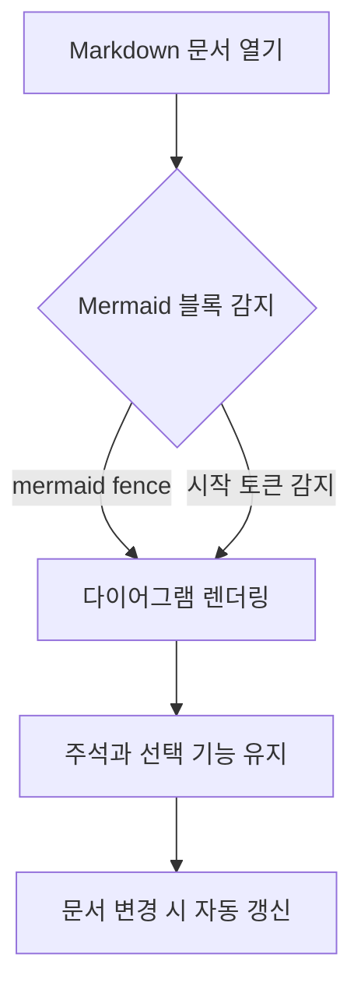
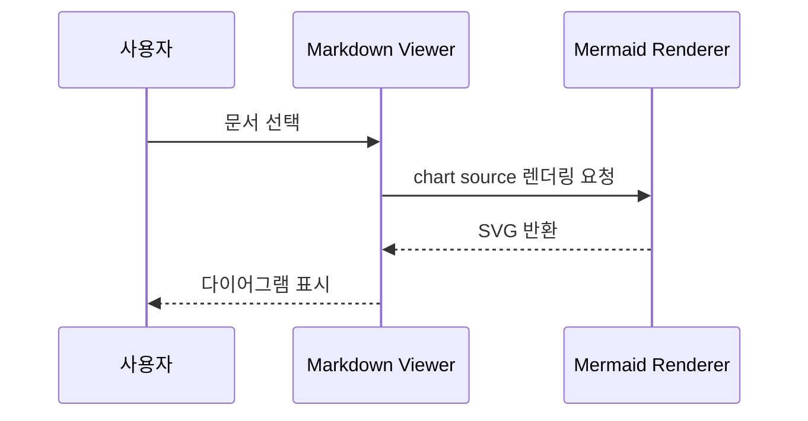

# Mermaid Chart Examples

Markdown annotator에서 Mermaid 코드 블록이 다이어그램으로 렌더링되는지 확인하기 위한 예제 문서입니다.

## 문서 검토 흐름



## 리뷰 시퀀스



## 상태 변경

아래 블록은 `mermaid` 언어 표기 없이 시작 토큰만으로 Mermaid chart로 감지되는 예입니다.

```
stateDiagram-v2
  [*] --> Loaded
  Loaded --> Annotating: 텍스트 선택
  Annotating --> Reloaded: 파일 변경 감지
  Reloaded --> Loaded: 최신 문서 반영
```

## 일반 코드 블록

일반 코드 블록은 Mermaid로 렌더링되지 않아야 합니다.

```ts
const flowchartFactory = () => "ordinary code block";
```
